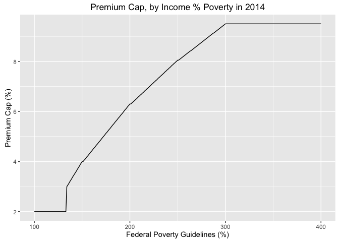

<!-- README.md is generated from README.Rmd. Please edit that file -->
About
=====

This repo contains R code for generating the ACA premium caps. Source: [Explaining Health Care Reform: Questions About Health Insurance Subsidies](http://kff.org/health-reform/issue-brief/explaining-health-care-reform-questions-about-health/)

Data
====

``` r
load("premiumCap2014.rda")
premiumCap2014
#>     fpg  cap
#> 1   100 2.00
#> 2   101 2.00
#> 3   102 2.00
#> 4   103 2.00
#> 5   104 2.00
#> 6   105 2.00
#> 7   106 2.00
#> 8   107 2.00
#> 9   108 2.00
#> 10  109 2.00
#> 11  110 2.00
#> 12  111 2.00
#> 13  112 2.00
#> 14  113 2.00
#> 15  114 2.00
#> 16  115 2.00
#> 17  116 2.00
#> 18  117 2.00
#> 19  118 2.00
#> 20  119 2.00
#> 21  120 2.00
#> 22  121 2.00
#> 23  122 2.00
#> 24  123 2.00
#> 25  124 2.00
#> 26  125 2.00
#> 27  126 2.00
#> 28  127 2.00
#> 29  128 2.00
#> 30  129 2.00
#> 31  130 2.00
#> 32  131 2.00
#> 33  132 2.00
#> 34  133 2.00
#> 35  134 3.00
#> 36  135 3.06
#> 37  136 3.12
#> 38  137 3.19
#> 39  138 3.25
#> 40  139 3.31
#> 41  140 3.38
#> 42  141 3.44
#> 43  142 3.50
#> 44  143 3.56
#> 45  144 3.62
#> 46  145 3.69
#> 47  146 3.75
#> 48  147 3.81
#> 49  148 3.88
#> 50  149 3.94
#> 51  150 4.00
#> 52  151 4.00
#> 53  152 4.05
#> 54  153 4.09
#> 55  154 4.14
#> 56  155 4.19
#> 57  156 4.23
#> 58  157 4.28
#> 59  158 4.33
#> 60  159 4.38
#> 61  160 4.42
#> 62  161 4.47
#> 63  162 4.52
#> 64  163 4.56
#> 65  164 4.61
#> 66  165 4.66
#> 67  166 4.70
#> 68  167 4.75
#> 69  168 4.80
#> 70  169 4.84
#> 71  170 4.89
#> 72  171 4.94
#> 73  172 4.99
#> 74  173 5.03
#> 75  174 5.08
#> 76  175 5.13
#> 77  176 5.17
#> 78  177 5.22
#> 79  178 5.27
#> 80  179 5.31
#> 81  180 5.36
#> 82  181 5.41
#> 83  182 5.46
#> 84  183 5.50
#> 85  184 5.55
#> 86  185 5.60
#> 87  186 5.64
#> 88  187 5.69
#> 89  188 5.74
#> 90  189 5.78
#> 91  190 5.83
#> 92  191 5.88
#> 93  192 5.92
#> 94  193 5.97
#> 95  194 6.02
#> 96  195 6.07
#> 97  196 6.11
#> 98  197 6.16
#> 99  198 6.21
#> 100 199 6.25
#> 101 200 6.30
#> 102 201 6.30
#> 103 202 6.34
#> 104 203 6.37
#> 105 204 6.41
#> 106 205 6.44
#> 107 206 6.48
#> 108 207 6.51
#> 109 208 6.55
#> 110 209 6.59
#> 111 210 6.62
#> 112 211 6.66
#> 113 212 6.69
#> 114 213 6.73
#> 115 214 6.76
#> 116 215 6.80
#> 117 216 6.84
#> 118 217 6.87
#> 119 218 6.91
#> 120 219 6.94
#> 121 220 6.98
#> 122 221 7.01
#> 123 222 7.05
#> 124 223 7.09
#> 125 224 7.12
#> 126 225 7.16
#> 127 226 7.19
#> 128 227 7.23
#> 129 228 7.26
#> 130 229 7.30
#> 131 230 7.34
#> 132 231 7.37
#> 133 232 7.41
#> 134 233 7.44
#> 135 234 7.48
#> 136 235 7.51
#> 137 236 7.55
#> 138 237 7.59
#> 139 238 7.62
#> 140 239 7.66
#> 141 240 7.69
#> 142 241 7.73
#> 143 242 7.76
#> 144 243 7.80
#> 145 244 7.84
#> 146 245 7.87
#> 147 246 7.91
#> 148 247 7.94
#> 149 248 7.98
#> 150 249 8.01
#> 151 250 8.05
#> 152 251 8.05
#> 153 252 8.08
#> 154 253 8.11
#> 155 254 8.14
#> 156 255 8.17
#> 157 256 8.20
#> 158 257 8.23
#> 159 258 8.26
#> 160 259 8.29
#> 161 260 8.32
#> 162 261 8.35
#> 163 262 8.38
#> 164 263 8.41
#> 165 264 8.43
#> 166 265 8.46
#> 167 266 8.49
#> 168 267 8.52
#> 169 268 8.55
#> 170 269 8.58
#> 171 270 8.61
#> 172 271 8.64
#> 173 272 8.67
#> 174 273 8.70
#> 175 274 8.73
#> 176 275 8.76
#> 177 276 8.79
#> 178 277 8.82
#> 179 278 8.85
#> 180 279 8.88
#> 181 280 8.91
#> 182 281 8.94
#> 183 282 8.97
#> 184 283 9.00
#> 185 284 9.03
#> 186 285 9.06
#> 187 286 9.09
#> 188 287 9.12
#> 189 288 9.14
#> 190 289 9.17
#> 191 290 9.20
#> 192 291 9.23
#> 193 292 9.26
#> 194 293 9.29
#> 195 294 9.32
#> 196 295 9.35
#> 197 296 9.38
#> 198 297 9.41
#> 199 298 9.44
#> 200 299 9.47
#> 201 300 9.50
#> 202 301 9.50
#> 203 302 9.50
#> 204 303 9.50
#> 205 304 9.50
#> 206 305 9.50
#> 207 306 9.50
#> 208 307 9.50
#> 209 308 9.50
#> 210 309 9.50
#> 211 310 9.50
#> 212 311 9.50
#> 213 312 9.50
#> 214 313 9.50
#> 215 314 9.50
#> 216 315 9.50
#> 217 316 9.50
#> 218 317 9.50
#> 219 318 9.50
#> 220 319 9.50
#> 221 320 9.50
#> 222 321 9.50
#> 223 322 9.50
#> 224 323 9.50
#> 225 324 9.50
#> 226 325 9.50
#> 227 326 9.50
#> 228 327 9.50
#> 229 328 9.50
#> 230 329 9.50
#> 231 330 9.50
#> 232 331 9.50
#> 233 332 9.50
#> 234 333 9.50
#> 235 334 9.50
#> 236 335 9.50
#> 237 336 9.50
#> 238 337 9.50
#> 239 338 9.50
#> 240 339 9.50
#> 241 340 9.50
#> 242 341 9.50
#> 243 342 9.50
#> 244 343 9.50
#> 245 344 9.50
#> 246 345 9.50
#> 247 346 9.50
#> 248 347 9.50
#> 249 348 9.50
#> 250 349 9.50
#> 251 350 9.50
#> 252 351 9.50
#> 253 352 9.50
#> 254 353 9.50
#> 255 354 9.50
#> 256 355 9.50
#> 257 356 9.50
#> 258 357 9.50
#> 259 358 9.50
#> 260 359 9.50
#> 261 360 9.50
#> 262 361 9.50
#> 263 362 9.50
#> 264 363 9.50
#> 265 364 9.50
#> 266 365 9.50
#> 267 366 9.50
#> 268 367 9.50
#> 269 368 9.50
#> 270 369 9.50
#> 271 370 9.50
#> 272 371 9.50
#> 273 372 9.50
#> 274 373 9.50
#> 275 374 9.50
#> 276 375 9.50
#> 277 376 9.50
#> 278 377 9.50
#> 279 378 9.50
#> 280 379 9.50
#> 281 380 9.50
#> 282 381 9.50
#> 283 382 9.50
#> 284 383 9.50
#> 285 384 9.50
#> 286 385 9.50
#> 287 386 9.50
#> 288 387 9.50
#> 289 388 9.50
#> 290 389 9.50
#> 291 390 9.50
#> 292 391 9.50
#> 293 392 9.50
#> 294 393 9.50
#> 295 394 9.50
#> 296 395 9.50
#> 297 396 9.50
#> 298 397 9.50
#> 299 398 9.50
#> 300 399 9.50
#> 301 400 9.50

library(ggplot2)
ggplot(premiumCap2014, aes(x = fpg, y = cap)) +
  geom_line() +
  labs(x = "Federal Poverty Guidelines (%)",
       y = "Premium Cap (%)",
       title = "Premium Cap, by Income % Poverty in 2014")
```


